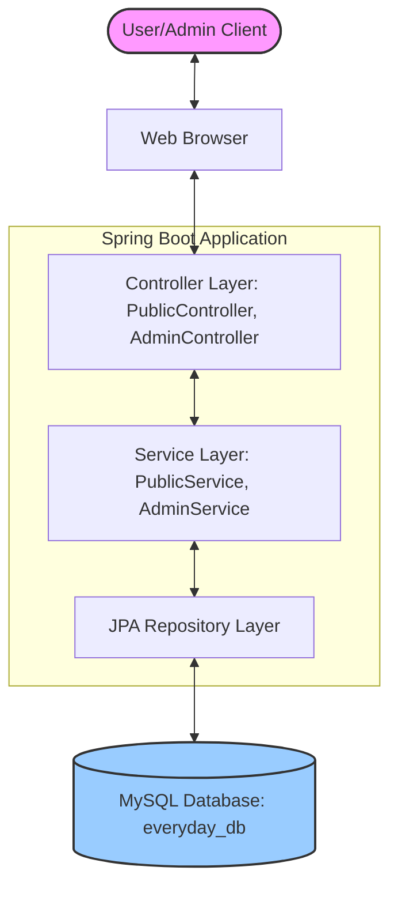
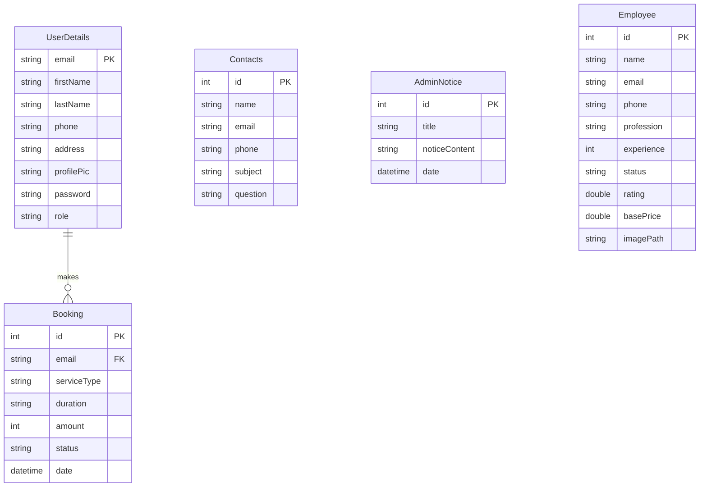
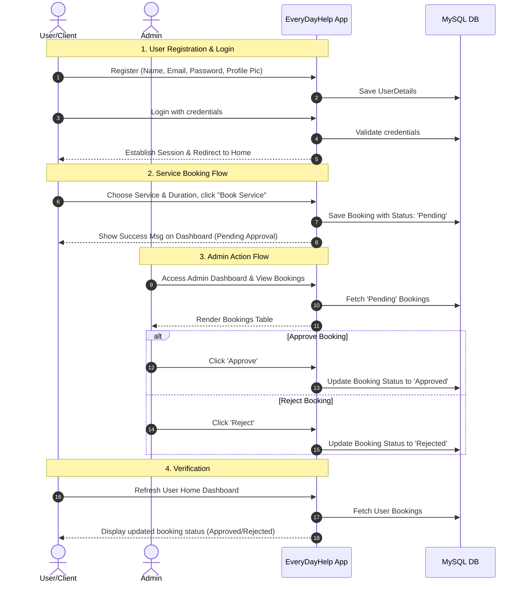

# EveryDayHelp 🛠️

**EveryDayHelp** is a comprehensive, Spring Boot-based web portal designed to connect customers with verified local service professionals (plumbers, electricians, chefs, gardeners, etc.). The application features an interactive user dashboard for booking services and an administrative control panel for managing employee listings, approving/rejecting service requests, posting announcements, and handling customer inquiries.

---

## 🏗️ Architecture Overview

The system is built using a classic **layered MVC architecture** on top of Spring Boot, Thymeleaf (frontend templates), and MySQL (relational database).



- **Controller Layer:** Processes incoming requests, manages sessions, and resolves view templates.
- **Service Layer:** Houses core business logic, validation rules, and coordinate data transfers.
- **Repository Layer:** Extends Spring Data JPA to execute database operations cleanly.
- **Database:** Stores relational mappings with auto-updates via Hibernate DDL.

---

## 🗄️ Database Design (ER Diagram)

The database consists of 5 main entities to track users, service records, employees, notices, and communications:



---

## 🔄 User & Admin Interaction Flow

This sequence chart describes the lifecycle of a user registering, booking a service, and an admin managing the booking:



---

## 💻 Tech Stack

- **Backend:** Java 21, Spring Boot 3.5.0 (Spring MVC, Spring Data JPA, Hibernate, Cryptography)
- **Frontend:** HTML5, Thymeleaf, Bootstrap 5.3.6, Font Awesome 6.7.2
- **Database:** MySQL 8.0.37 (Hikari Connection Pool)
- **Build Tool:** Apache Maven 3.9.10

---

## 🚀 Setup & Local Execution

### Prerequisites
- **Java Development Kit (JDK) 21** or higher.
- **MySQL Server** running locally.
- **Maven** (optional, wrapper script `./mvnw` is included in the project root).

### 1. Database Configuration
Create a schema named `everyday_db` in your MySQL database:
```sql
CREATE DATABASE everyday_db;
```
Configure your connection details in [src/main/resources/application.properties](file:///c:/Users/KIIT0001/OneDrive/Desktop/STUDY/Spring/EveryDayHelp/src/main/resources/application.properties):
```properties
spring.datasource.url=jdbc:mysql://localhost:3306/everyday_db?createDatabaseIfNotExist=true
spring.datasource.username=YOUR_MYSQL_USERNAME
spring.datasource.password=YOUR_MYSQL_PASSWORD
server.port=8085
```

### 2. Running the Application
Open a terminal in the project root directory and execute the following command:
```bash
# Windows
.\mvnw.cmd spring-boot:run

# macOS / Linux
chmod +x mvnw
./mvnw spring-boot:run
```
Once the log prints `Started EveryDayHelpApplication`, open your browser to [http://localhost:8085/](http://localhost:8085/).
